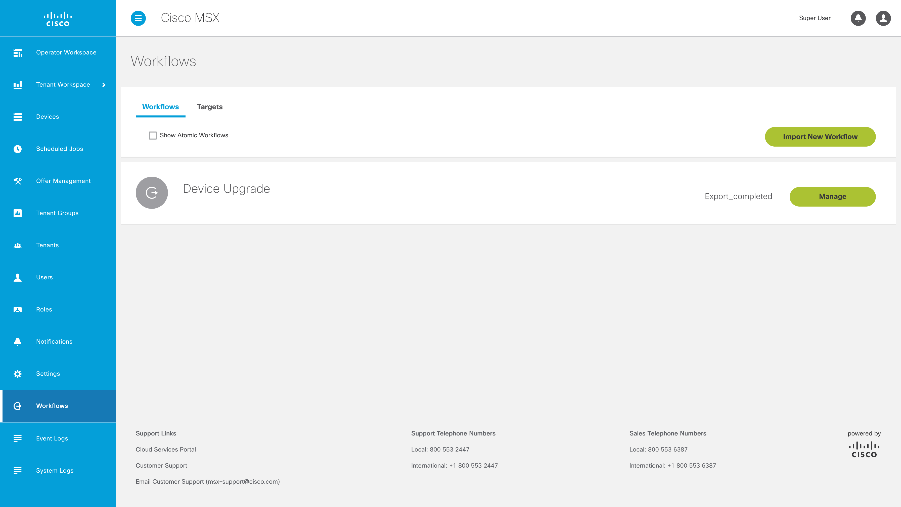
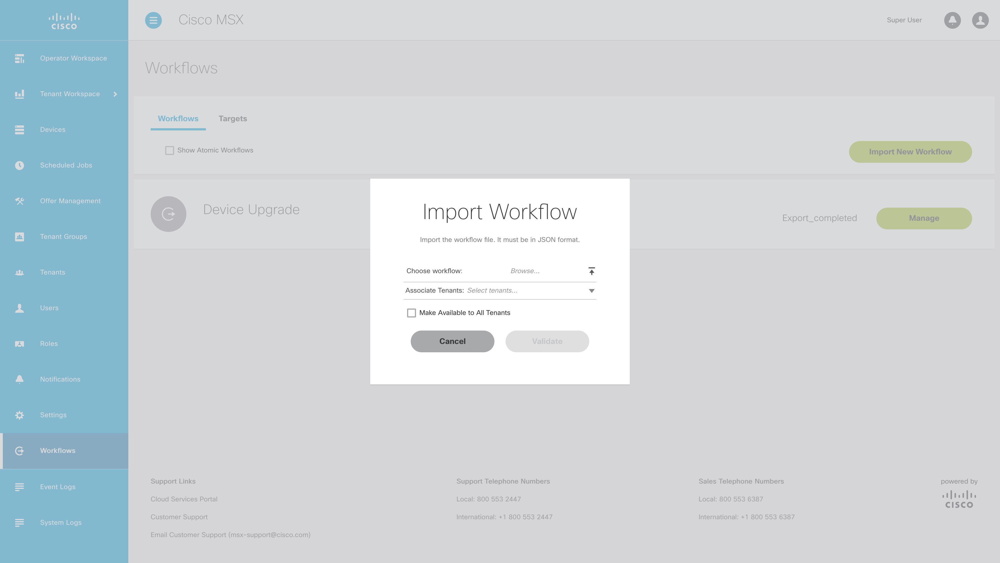
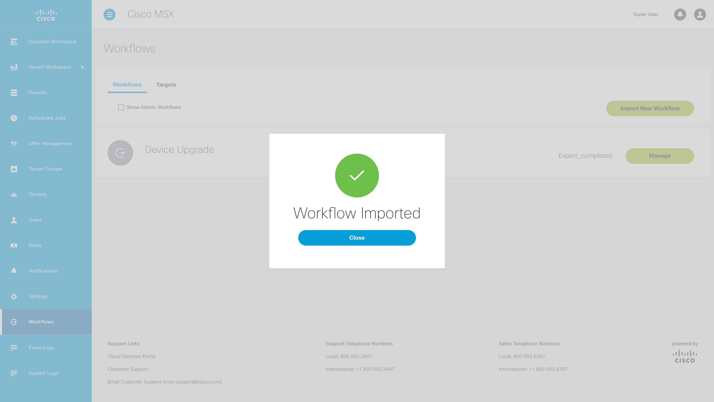

# Workflow Backed Service Control
* [Introduction](#introduction)
* [Goals](#goals)
* [Prerequisites](#prerequisites)
* [Exclusions](#exclusions)

* [Quick Start Guide](#quick-start-guide)
  * [Importing the Workflow](#importing-the-workflow)
  * [Building the Service Control](#building-the-service-control)
  * [Deploying the Service Control](#deploying-the-service-control)

* [Project Deep Dive](#project-deep-dive)
  * [Tenant Workspace Hooks](#tenant-workspace-hooks)
  * [UI Router States](#ui-router-states)
  * [Workflow Executor](#workflow-executor)

* [Bootstrapping New Service Controls](#bootstrapping-new-service-controls)
  * [Calling a Different Workflow](#calling-a-different-workflow)
  * [Deploying Multiple Service Controls](#deploying-multiple-service-controls)
    * [bin/build.sh](#binbuildsh)
    * [config/manifest.yml](#configmanifestyml)
    * [config/nginx.conf](#confignginxconf)
    * [src/metadata/catalogMetadata.json](#srcmetadatacatalogmetadatajson)
    * [src/ui/workflow-executor/workflow-executor.module.ts](#srcuiworkflow-executorworkflow-executormodulets)
    * [src/ui/routes.ts](#srcuiroutests)
    * [src/ui/tcui-hooks.ts](#srcuitcui-hookts)
    * [Dockerfile](#Dockerfile)


## Introduction
This project is an example extension for MSX that adds a service control that is
not bound to any service pack. The service control adds a new state to the UI
router which renders an Angular component that can execute a workflow, currently
the `Hello World` workflow found in the `workflows` folder.


## Goals
* build a workflow backed service control
* deploy that service control into MSX
* update the project to deploy as a second service control
* update the project to call a different workflow


## Prerequisites
* the workflow service control example source code [(help me)](https://cto-github.cisco.com/NFV-BU/workflow-service-control-example)
* npm v6.14.16 [(help me)](https://www.npmjs.com/package/npm/v/6.14.6)
* node v14.19.0 [(help me)](https://nodejs.org/download/release/v14.19.0/)
* Docker Desktop [(help me)](https://www.docker.com/products/docker-desktop)

MacOS users can use Brew to install npm and node as follows:
```
$ /bin/bash -c "$(curl -fsSL https://raw.githubusercontent.com/Homebrew/install/HEAD/install.sh)"
$ brew install node@14
```


## Exclusions
This example was developed as a proof of concept and should not be considered production code.
Out of the box this project has the current limitations:
* the workflow must be imported into MSX manually
* without modification the project can only call the included workflow
* without modification the project can only deploy a single service control


## Quick Start Guide
In the next few sections explain who to build and deploy the project as-is in to an
MS envionrment.

### Importing the Workflow
To import the workflow called `workflows/20210730_Hello World 2.json` into your MSX
environment, follow these steps:

1. Click on the "Workflow" item in the left-hand menu panel of the MSX UI



2. Click on "Import New Workflow" and select the Workflow (in JSON) that you would like to import.



3. Follow the steps, until you see the "Success" prompt




### Building the Service Control
To build the workflow backed service control, follow these steps:

1. Clone this GitHub repository on your machine [(help me)](https://cto-github.cisco.com/NFV-BU/workflow-service-control-example)
2. Look up the `unique_name` field from `workflows/20210730_Hello World 2.json`.
3. Copy the `unique_name` field from the JSON and update the variable `WorkflowUniqueName` in `workflow-executor/workflow-executor.component.ts`
4. Navigate to the local repository on the machine in terminal and run the following command `npm run build`.
5. The build will produce file `build/workflowexecutor_slm_deployable.tar.gz` which can be deployed to MSX.


### Deploying the Service Control
To deploy the workflow backed service control, follow these steps:

1. Sign in to your MSX environment and deploy the service control [(help me)](https://ciscodevnet.github.io/msx-developer-guides/03-msx-component-manager/04-onboarding-and-deploying-components.html).


## Project Deep Dive
Above we showed how to build and deploy the project as-is. In the following sections
we will describe the structure of the project in more depth.

### Tenant Workspace Hooks
Files:

```
src/ui/tcui-hooks.ts
```

The `hooksClass` export of this file is used by MSX to set up the tenant
workspace for a service pack. Since this extension only installs a new service
control, only the `getServiceControlsConfig` hook method is defined.

This service control's configuration tells MSX to go to the
`app.workflow-executor` router state when the service control is activated by
the user.


### UI Router States
Files:

```
src/ui/routes.ts
src/ui/workflow-executor/workflow-executor.module.ts
```

MSX's UI is controlled by a finite state machine known as the router, which
renders parts of the application based on the state it is in. The `routes`
property exported by `routes.ts` is used by MSX to add new states to the router.

This example makes use of the new lazy loading capability in the Angular version
of the router by instead defining a "future state", `app.workflow-executor.**`,
which will load the `WorkflowExecutor` module and component when the user
enters that router state, instead of loading them eagerly during application
start up, which reduces start up times.

The `WorkflowExecutorModule` then contains the concrete router state definitions
which will be loaded into the router when it is loaded.


### Workflow Executor
Files:

```
src/ui/workflow-executor/workflow-executor.component.ts
src/ui/workflow-executor/hello-world.form.ts
```

The `WorkflowExecutorComponent` is the primary component rendered by MSX for
this example. It uses the `Form` factory defined in `hello-world.form.ts` to
render a form for the `Hello World` workflow using the `<msx-form>`
component. Once all fields of the form are valid and present, pressing the
submit button will do the following:

1. Request the workflow's start config
2. Start a new instance of the workflow using the values from the form
3. Poll the instance until it is complete
4. Display the value of any `output` type variables from the instance in the
   right-hand panel.


## Bootstrapping New Service Controls
The example provided is only meant to be illustrative, to deliver a real
solution you will need use the example to bootstrap a new service control.

### Calling a Different Workflow
Files:

```
src/workflow-executor/my-new.form.ts
src/workflow-executor/workflow-executor.component.ts
src/workflow-executor/workflow-executor.component.html
```

If you need the service control to execute a different workflow do the following:

1. Upload your workflow to a target MSX instance.
2. Retrieve the `unique_name` of the workflow on that instance, and set it in the
   `workflowUniqueName` constant in `workflow-executor.component.ts`
3. Create a new file exporting the `Form` factory for your workflow, which
   should contain all the fields required for your workflow.
4. Import the new factory into `WorkflowExecutorComponent`, and change the form
   bound to the `<msx-form>` component's `form` property in
   `workflow-executor.component.html`.


### Deploying Multiple Service Controls
Files:

```
bin/build.sh
config/manifest.yml
config/nginx.conf
src/metadata/catalogMetadata.json
src/ui/workflow-executor/workflow-executor.module.ts
src/ui/routes.ts
src/ui/tcui-hooks.ts
Dockerfile
```

If you need to deploy multiple service controls that call different workflows, first
duplicate the project and follow the instructions above to call a different workflow.
Then update the new project as shown below to make it deploy as a separate service control.


### bin/build.sh
The name of each image SLM tarball has to match the corresponding container name in
the SLM manifest. So update everywhere you see `workflowexecutor` to something new like
`workflowexecutor2` as shown below.

```shell
.
.
.
docker build -t workflowexecutor2:1.0.0 .
docker save  workflowexecutor2:1.0.0 | gzip > build/slmimage-workflowexecutor2-1.0.0.tar.gz
.
.
.
if [ -f "$TAR" ] ; then
	$TAR --exclude=./tcui_package.zip --exclude=./services -czf  workflowexecutor2_slm_deployable.tar.gz *
	rm -f slmimage-workflowexecutor2-1.0.0.tar.gz
fi
.
.
.
```


### config/manifest.yml
In order to make the component unique the following changes are to be made to
the `config/manifest.yml` file.

1. Change the component name from `workflowexecutor` to `workflowexecutor2`.
2. Change the container name from `workflowexecutor` to `workflowexecutor2`.
3. Change the container name tag from `workflowexecutor` to `workflowexecutor2`.
4. Update the `InstanceUUID` under "Tags" by generating a new UUID.
4. Change the context path from `/workflowexecutorui` to `/workflowexecutorui2`
5. Change the health check path from `/workflowexecutorui/workflowexecutor.css` to `/workflowexecutorui2/workflowexecutor.css`
6. Change the container endpoint from `/workflowexecutorui` to `/workflowexecutorui2`

```yaml
---
Name: "workflowexecutor2" # CHANGE THE COMPONENT NAME
Description: "New Workflow Executor"
Version: "1.0.0"
Type: Internal
Containers:
  - Name: "workflowexecutor2" # CHANGE THE CONTAINER NAME
    Version: "1.0.0"
    Artifact: "slmimage-workflowexecutor2-1.0.0.tar.gz" # CHANGE THE CONTAINER ARTIFACT
    Port: 4200
    ContextPath: "/workflowexecutorui2" # CHANGE THE CONTEXT PATH
    Tags:
      - "productUI"
      - "buildNumber=1.0.0"
      - "instanceUuid=f4abade6-bdf3-4895-a43b-f5365fa45dce"
      - "buildDateTime=2021-07-30T21:38:53.547Z"
      - "name=workflowexecutor2" # CHANGE THE CONTAINER NAME TAG
      - "version=1.0.0"
    Check:
      Http:
        Host: "127.0.0.1"
        Scheme: "http"
        Path: "/workflowexecutorui2/workflowexecutor.css" # CHANGE THE CONTEXT PATH
      IntervalSec: 60
      InitialDelaySec: 30
      TimeoutSec: 30
    Limits:
      Memory: "256Mi"
      CPU: "1"
    Command:
      - "/docker-entrypoint.sh"
      - "nginx"
      - "-g"
      - "daemon off;"
    Endpoints:
      - "/workflowexecutorui2" # CHANGE THE CONTAINER ENDPOINT
```


### config/nginx.conf
Update the nginx configuration to point at the new location.

```
server {
  listen 4200;

  location /workflowexecutorui2 { // CHANGE THE LOCATION
    root /usr/share/nginx/html;
  }

  include /etc/nginx/extra-conf.d/*.conf;
}
```

## src/metadata/catalogMetadata.json
Update the metadata to match the name set in the SLM manifest:

```JSON
{
	"services": [
		{
			"id": "057b38e6-a78b-4141-8664-f026646bb793", # CREATE A NEW UUID FOR THE SERVICE CONTROL
			"name": "workflowexecutor2", # UPDATE THE NAME TO MATCH THE MANIFEST
			"label": "workflowexecutor2.service.property.name",
			"active": true,
			"version": 1,
			"displayOrder": 1,
			"description": "workflowexecutor2.service.property.description",
			"image": "data:image/svg+xml;base64,PHN2ZyB2ZXJzaW9uPSIxLjEiIHhtbG5zPSJodHRwOi8vd3d3LnczLm9yZy8yMDAwL3N2ZyIgd2lkdGg9IjI0IiBoZWlnaHQ9IjI0IiB2aWV3Qm94PSIwIDAgMjQgMjQiPgoJPHBhdGggZD0iTTE4Ljc1IDIzLjc1bC01LjI1LTIuOTg1di01Ljk2N2w1LjI1LTIuOTg1IDUuMjUgMi45ODV2NS45Njd6TTYuNzUgOS4yMDN2LTUuOTY3bDUuMjUtMi45ODUgNS4yNSAyLjk4NXY1Ljk2N2wtNS4yNSAyLjk4NXpNMTAuNSAyMC43NjVsLTUuMjUgMi45ODUtNS4yNS0yLjk4NXYtNS45NjdsNS4yNS0yLjk4NSA1LjI1IDIuOTg1djUuOTY3eiI+PC9wYXRoPgo8L3N2Zz4K",
			"orderLimit": 1,
			"price": "0",
			"orchestrator": "none",
			"skipUsecaseValidation": true,
			"configuration": {
				"device": "false",
				"showOffers": "true",
				"validation": "none",
				"orchestrator": "none"
			},
			"options": [
				{
					"name": "workflowexecutor_option1",
					"label": "workflowexecutor2.service.option1.label",
					"header": null,
					"description": "workflowexecutor2.service.option1.description",
					"hint": "workflowexecutor2.service.option1.hint",
					"supported": true
				}
			],
			"properties": [],
			"sections": [
				{}
			],
			"slmUiConfig": {
				"type": "ng2-extension",
				"resources": [
					{
						"type": "ui-info",
						"href": "/workflowexecutorui2/ui-info.js" # UPDATE THE CONTEST PATJ TO MATCH THE MANIFEST
					},
					{
						"type": "css",
						"href": "/workflowexecutorui2/workflowexecutor.css" # UPDATE THE CONTEST PATJ TO MATCH THE MANIFEST
					},
					{
						"type": "routes",
						"href": "/workflowexecutorui2/routes.js" # UPDATE THE CONTEST PATJ TO MATCH THE MANIFEST
					},
					{
						"type": "i18n",
						"href": "/workflowexecutorui2/i18n/i18n.json" # UPDATE THE CONTEST PATJ TO MATCH THE MANIFEST
					},
					{
						"type": "tcui-hooks",
						"href": "/workflowexecutorui2/tcui-hooks.js" # UPDATE THE CONTEST PATH TO MATCH THE MANIFEST
					},
					{
						"type": "app-main",
						"href": "/workflowexecutorui2/app.js" # UPDATE THE CONTEST PATH TO MATCH THE MANIFEST
					},
					{
						"type": "online-help",
						"href": "/workflowexecutorui2/help/help.json" # UPDATE THE CONTEST PATH TO MATCH THE MANIFEST
					}
				]
			},
			"parentId": null,
			"resource": false,
			"offers": [
				{
					"name": "workflowexecutor_offer0",
					"label": "workflowexecutor2.service.offer0.label",
					"version": 1,
					"displayOrder": 1,
					"uuid": "0a6c7455-e67a-4cc0-a652-3859189a9e3d",
					"productId": "057b38e6-a78b-4141-8664-f026646bb793", # SET THIS TO THE NEW UUID YOU CREATED
					"description": "workflowexecutor2.service.offer0.description.label",
					"image": "data:image/svg+xml;base64,PHN2ZyB2ZXJzaW9uPSIxLjEiIHhtbG5zPSJodHRwOi8vd3d3LnczLm9yZy8yMDAwL3N2ZyIgd2lkdGg9IjI0IiBoZWlnaHQ9IjI0IiB2aWV3Qm94PSIwIDAgMjQgMjQiPgoJPHBhdGggZD0iTTE4Ljc1IDIzLjc1bC01LjI1LTIuOTg1di01Ljk2N2w1LjI1LTIuOTg1IDUuMjUgMi45ODV2NS45Njd6TTYuNzUgOS4yMDN2LTUuOTY3bDUuMjUtMi45ODUgNS4yNSAyLjk4NXY1Ljk2N2wtNS4yNSAyLjk4NXpNMTAuNSAyMC43NjVsLTUuMjUgMi45ODUtNS4yNS0yLjk4NXYtNS45NjdsNS4yNS0yLjk4NSA1LjI1IDIuOTg1djUuOTY3eiI+PC9wYXRoPgo8L3N2Zz4K",
					"supportedProperties": [
            "Basic-small"
          ],
					"supportedOptions": [
						{
							"name": "workflowexecutor_option1",
							"value": "Yes"
						}
					],
					"priceplans": [
						{
							"uuid": "ddd94bf3-86ee-44f3-8ef3-3b10c9b5b935",
							"name": "12 Month",
							"serviceId": "057b38e6-a78b-4141-8664-f026646bb793", # SET THIS TO THE NEW UUID YOU CREATED
							"offerId": "0a6c7455-e67a-4cc0-a652-3859189a9e3d",
							"version": 1,
							"currentVersion": true,
							"startDate": null,
							"endDate": null,
							"currency": "USD",
							"oneTimePrice": 0,
							"periodicPrice": 100,
							"timePeriod": "monthly",
							"pricePlanAttributes": []
						}
					],
					"terms": [
						{
							"serviceId": "057b38e6-a78b-4141-8664-f026646bb793", # SET THIS TO THE NEW UUID YOU CREATED
							"offerId": "0a6c7455-e67a-4cc0-a652-3859189a9e3d",
							"id": "1dd14d87-4925-49e6-b2ac-cf5666ea64b6",
							"htmlContent": "workflowexecutor2.service.offer0.terms"
						}
					]
				}
			]
		}
	]
}
```


## src/ui/i18n.json
All service control deployed via SLM run within the same Angular application so
update all resource id prefixes from `workflowexecutor.` to a something new like
`workflowexecutor2.` then update all references in the code. A good IDE can simplify
this task.


### src/ui/workflow-executor/workflow-executor.module.ts
Update the `name` and `url`  in the `states` section of the `workflow-executor.module.ts` file.

```typescript
.
.
.
      states: [
        {
          name: 'app.workflow-executor-2', // CHANGE THIS ID
          url: '/workflow-executor-2', // CHANGE THIS URL
          views: {
            'module@app': {
              component: WorkflowExecutorComponent
            }
          },
        },
.
.
.
```


### src/ui/routes.ts
Because this example defines a router state that does not use a unique id it
cannot be installed multiple times on a system without modification. Multiple
router states with the same id will fail to load.

To configure multiple versions of this example to install as different service
controls change the `app.workflow-executor` part of the state's id to a unique
value for that extension, e.g. `app.workflow-executor-2`.

```typescript
import type { Ng2StateDeclaration } from '@uirouter/angular';

export const routes: Ng2StateDeclaration[] = [
  {
    name: 'app.workflow-executor-2.**', // CHANGE THIS ID
    url: '/workflow-executor-2', // CHANGE THIS URL
    loadChildren: () =>
      import('./workflow-executor').then(mod => mod.WorkflowExecutorModule),
  },
];
```


### src/ui/tcui-hook.ts
Update the `route` in the `controls` section of the `tcui-hook.ts` file.

```typescript
.
.
.
controls: [
  {
    label: 'workflowexecutor2.service_control.workflow_executor.name',
    iconClass: 'vms_fi_editor7040-24',
    description: 'workflowexecutor2.service_control.workflow_executor.description',
    route: 'app.workflow-executor-2' // CHANGE THIS ID
  }
],
.
.
.
```


### Dockerfile
Finally, update the Dockerfile to point to the correct location

```Dockerfile
FROM nginx:latest
COPY ./build/services /usr/share/nginx/html/workflowexecutorui2/
COPY ./config/nginx.conf /etc/nginx/conf.d/default.conf
```
